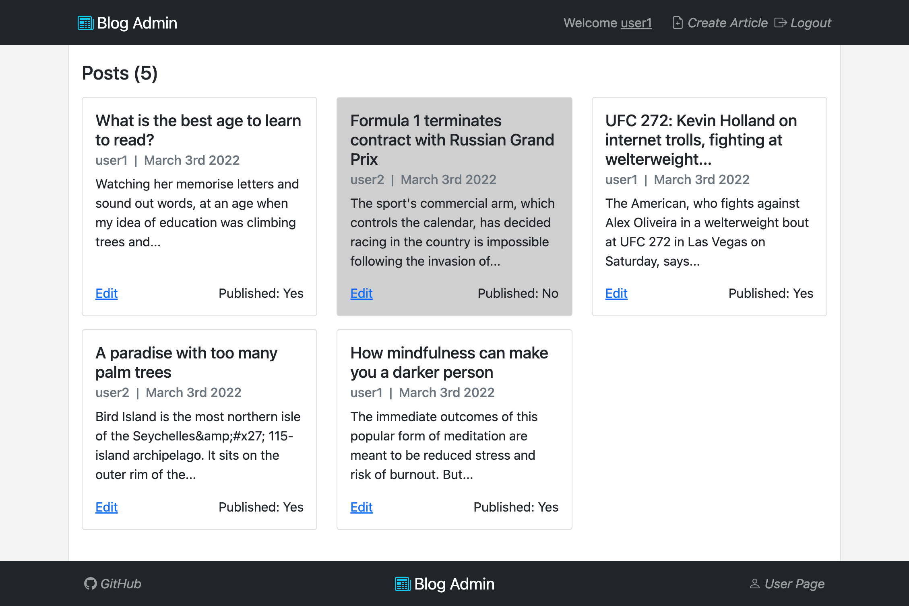
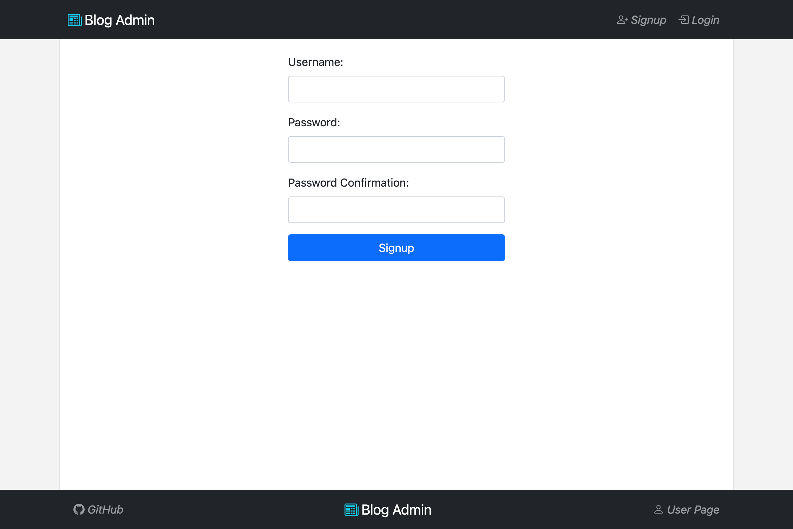
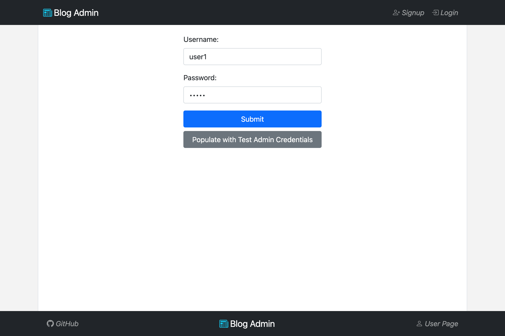
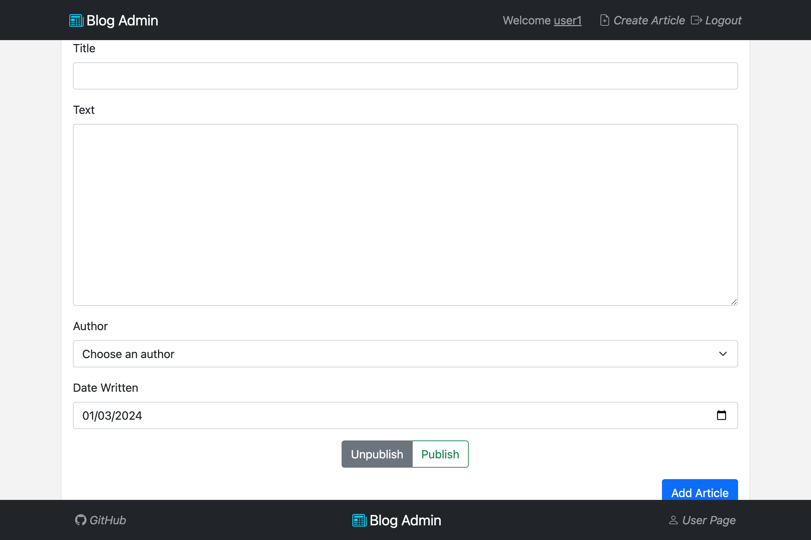
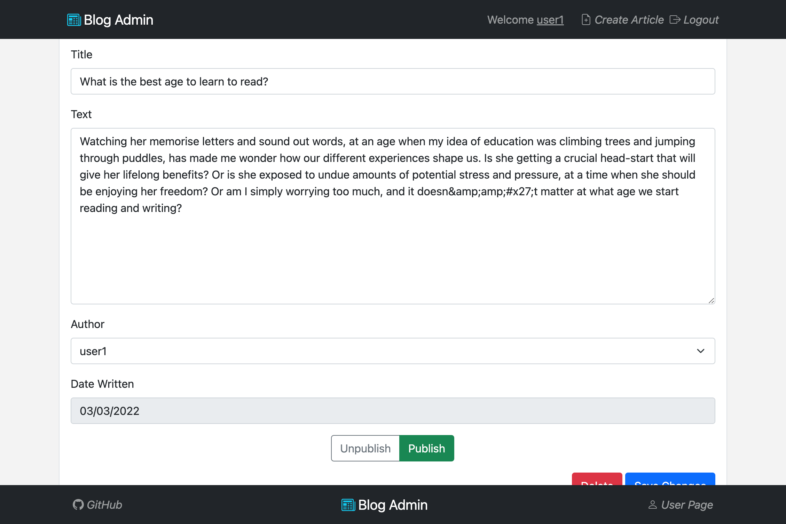
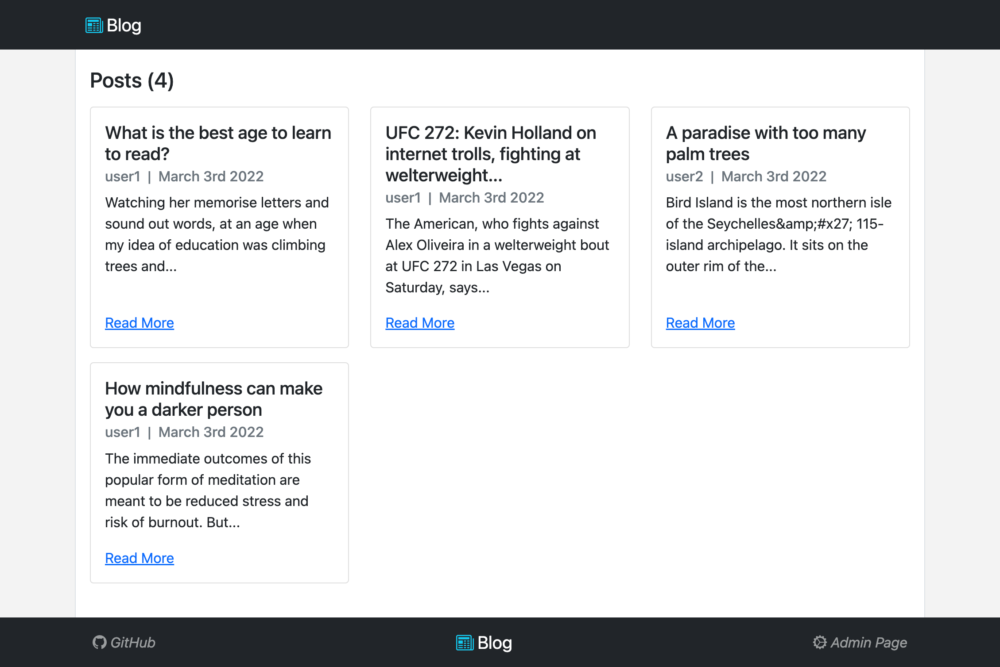
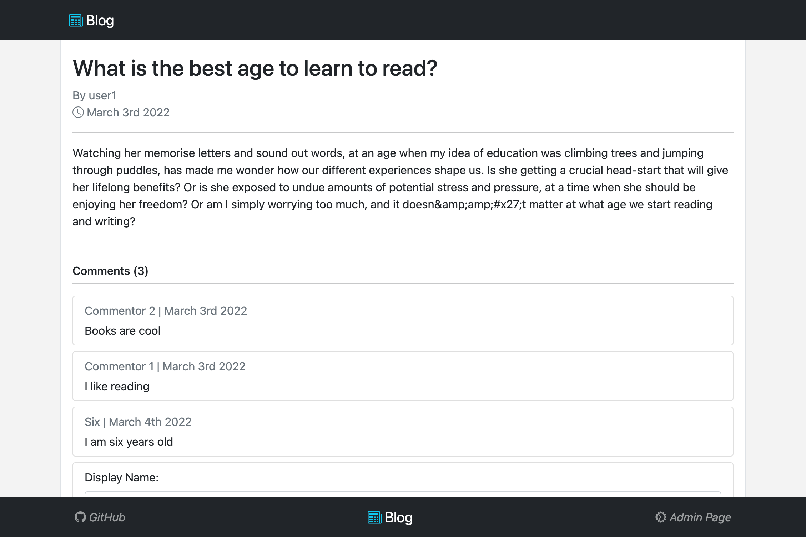
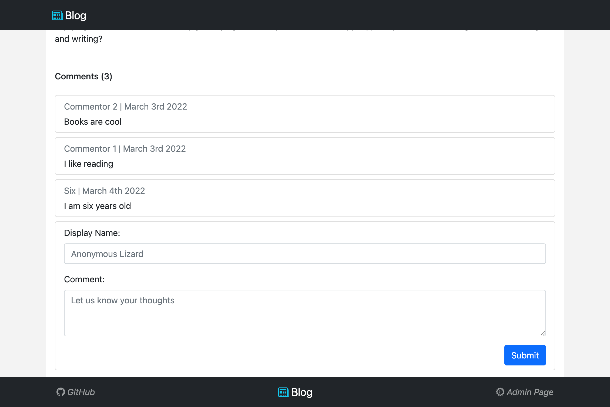

# Blog API

> Blog API is a full-stack blog application on the web. The application consists
> of a frontend for admin, another frontend for consumers, and a backend to serve
> both clients. The purpose of the admin application is to provide an authenticated
> portal for admins to create, edit, and publish blogs. The application for consumers
> enables them to read and comment on blog posts.

## Demo

Deployed on Render with Docker image - [Deployment Link](https://blog-api-v04g.onrender.com)



## Features

### Admin

#### Authentication

Admins can create a new account or login.




#### Homepage

An overview of all articles, both published and unpublished.


#### Create New Blog

Admins can create a blog article by populating the title, content, author,
and date written fields. They can also choose to either publish or save
the article as a draft.



#### Manage Blog

Admins can edit the chosen article's title, content, and author. They can
also choose to publish/unpublish the article or delete it from the server.



### Consumer

#### Homepage

An overview of all published articles.



#### Article Page

Consumers can read an article and see comments associated with it which were
created by other users or themselves.



#### Comment Submission

Consumers can submit a comment under an article.



## Getting Started

1. Create a `.env` file under `/server` and fill in all variables following
   `./server/.env.template`
2. Go to project directory then install dependencies for server and both clients

   ```shell
   cd blog-api
   npm run install:all
   ```

3. Run the server in dev mode with hot reload

   ```shell
   cd server
   npm run devStart
   ```

4. Run the admin client in dev mode with hot reload

   ```shell
   cd client-admin
   npm start
   ```

5. Run the regular client in dev mode with hot reload

   ```shell
   cd client
   npm start
   ```

## Technologies

- **Languages:** Javascript, HTML, CSS
- **Frameworks:** React.js, Node.js, Express.js, Bootstrap
- **Database:** MongoDB
- **Libraries/Miscellaneous:** Docker, REST API, JWT, Passport.js
